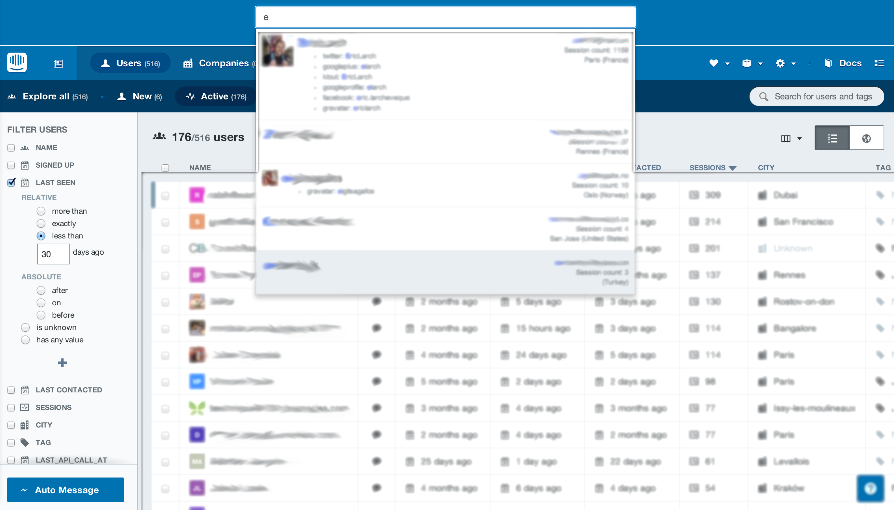

Intercom User Search
=====================

This is a Rails 4 application iframing [Intercom.io](http://www.intercom.io) and providing an improved users search on top of it.



Dependencies
------------

```ruby
gem 'intercom'
gem 'algoliasearch-rails'
gem 'hogan_assets'
```

Code
-----

##### application.yml
```yaml
INTERCOM_APP_ID: my-intecom-app-id
INTERCOM_API_KEY: my-intercom-super-crazy-api-key
ALGOLIA_APPLICATION_ID: my-algolia-application-id
ALGOLIA_API_KEY: my-algolia-api-key
ALGOLIA_SEARCH_ONLY_API_KEY: my-search-only-algolia-api-key
ALGOLIA_INDEX: myindexname
```

##### user.rb
```ruby
class User
  BATCH_SIZE = 10000

  def self.reindex!
    records = []
    index = Algolia::Index.new ENV['ALGOLIA_INDEX']
    index.set_settings attributesToIndex: ['name', 'email', 'social_profiles.username', 'location_data.city_name'],
      customRanking: ['desc(session_count)'],
      queryType: 'prefixAll'
    Intercom::User.all.each do |user|
      record = user.to_hash
      record['objectID'] = record.delete('intercom_id')
      record['social_profiles'] = user.social_profiles.map { |profile| JSON.parse(profile.to_json) }
      record['location_data'] = user.location_data
      records << record
      if records.size > BATCH_SIZE
        index.add_objects records
        records = []
      end
    end
    index.add_objects records unless records.empty?
  end
end
```

##### index.html
```html
<header id='header'>
  <div id='search-box'>
    <div class='form-horizontal'>
      <div class='form-group has-feedback'>
        <input class='form-control' id='input-user' placeholder='Search for users' type='text'>
        <span class='glyphicon glyphicon-search form-control-feedback'></span>
        <div class='powered-by text-right'>
          powered by
          
        </div>
      </div>
    </div>
  </div>
</header>
<section id='main'>
  <iframe id='iframe' src='https://www.intercom.io'></iframe>
</section>
<script>
  $(document).ready(function() {
    var client = new AlgoliaSearch('YourApplicationID', 'YourPublicAPIKey');
  
    var template = '<div class="hit">' +
      '{{#avatar_url}}' +
        '' +
      '{{/avatar_url}}' +
      '<div class="infos">' +
        '<span class="secondary">' +
          '{{#_highlightResult.name}}' +
            '{{{_highlightResult.email.value}}}' +
          '{{/_highlightResult.name}}' +
          '{{^_highlightResult.name}}' +
            '{{{_highlightResult.name.value}}}' +
          '{{/_highlightResult.name}}' +
        '</span>' +
        '<span class="session_count">Session count: {{{session_count}}}</span>' +
        '{{#_highlightResult.location_data}}' +
          '<span class="location_data">{{{_highlightResult.location_data.city_name.value}}} ({{{_highlightResult.location_data.country_name.value}}})</span>' +
        '{{/_highlightResult.location_data}}' +
      '</div>' +
      '<div class="middle">' +
        '<span class="primary">' +
          '{{#_highlightResult.name}}' +
            '{{{_highlightResult.name.value}}}' +
          '{{/_highlightResult.name}}' +
          '{{^_highlightResult.name}}' +
            '{{{_highlightResult.email.value}}}' +
          '{{/_highlightResult.name}}' +
        '</span>' +
        '<ul>{{#_highlightResult.social_profiles}}' +
            '{{#username.matchedWords}}' + 
              '<li class="social_profile">{{{type.value}}}: {{{username.value}}}</li>' +
            '{{/username.matchedWords}}' +
        '{{/_highlightResult.social_profiles}}</ul>' +
      '</div>' +
      '<div class="clearfix"></div>' +
    '</div>';
  
    $('#input-user').typeahead({
      remote: client.initIndex('YourIndexName').getTypeaheadTransport({ hitsPerPage: 5 }),
      engine: Hogan,
      template: template,
      valueKey: 'objectID'
    }).on('typeahead:selected', function() {
      var intercom_id = $(this).val();
      $('#iframe').attr('src', 'https://www.intercom.io/apps/YourIntercomAppID/users/' + intercom_id);
      $(this).val('');
      $(this).typeahead('setQuery', '');
    });
  });
</script>
```

Installation
--------------

* ```git clone https://github.com/algolia/algoliasearch-rails-example.git```
*  ```bundle install```
*  Create your ```config/application.yml``` based on ```config/application.example.yml``` with your [Algolia](http://www.algolia.com) and [Intercom](http://www.intercom.io) credentials
*  ```bundle exec rails runner User.reindex!```
*  ```bundle exec rails server```
*  Enjoy your ```http://localhost:3000``` examples!
